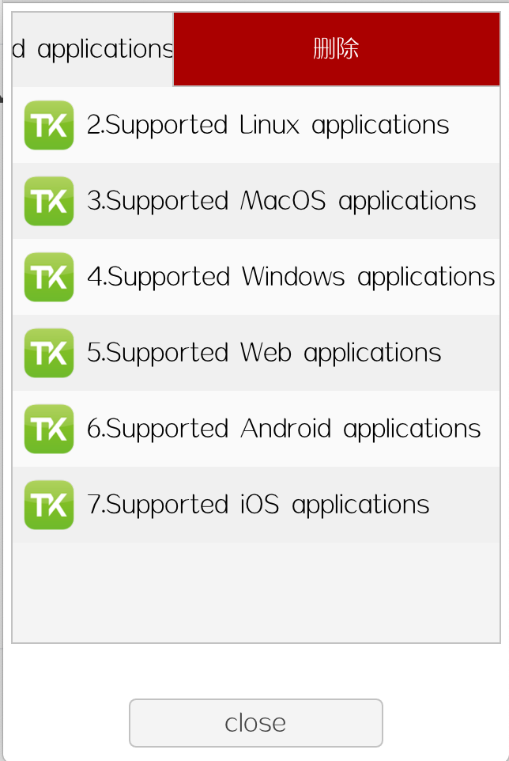

# awtk-widget-slidable_row

仿微信列表项。




## 准备

1. 获取 awtk 并编译

```
git clone https://github.com/zlgopen/awtk.git
cd awtk; scons; cd -
```

## 运行

1. 生成示例代码的资源

```
python scripts/update_res.py all
```
> 也可以使用 Designer 打开项目，之后点击 “打包” 按钮进行生成
> 如果资源发生修改，则需要重新生成资源。

2. 编译

* 编译选项

```
Usage: scons SHARED=[true|false] IDL_DEF=[true|false] LCD=[800_480|...] LINUX_FB[true|false] THEME=[theme] LANGUAGE=[lang] FONT=[font]
```

* 参数 SHARED 是可选的，用于指定是否编译生成动态库，缺省为 true。

* 参数 IDL_DEF 是可选的，用于指定编译前是否重新生成 idl.json 和 def 文件，缺省为 true。

* 参数 LCD 是可选的，用于指定示例程序运行时的 LCD 尺寸，格式为“height_width”。

* 参数 LINUX_FB 是可选的，是否编译 linux framebuffer 版本。

* 参数 FONT 是可选的，用于指定字体（如缺省为 default)。

* 参数 THEME 是可选的，用于指定主题（如缺省为 default)。

* 参数 LANGUAGE 是可选的，用于指定语言（如缺省为 zh_CN)。

> 注意：编译前先确定 SConstruct 文件中的 awtk_root 为 awtk 所在目录，否则会编译失败。

* 示例

> 缺省编译

```
scons
```

> 指定 LCD 大小

```
scons LCD=480_272
```

> 编译 linux fb 版本
```
scons LINUX_FB=true
```

3. 运行

```
./bin/demo
```

## 文档

### 1. 用法

slidable\_row 可以当作 list\_item 放在 list\_view 中，正常情况下它只显示第一个直系子节点。向左拖动可以显示其它子节点，其它子节点不作限制，但是要能在一行中显示出来。

```xml
<slidable_row style="odd">
  <label name="title"  style="title" text="4.Supported Windows applications"/>
  <button name="mark" style="mark" tr_text="Mark As Read" w="128"/>
  <button name="remove" style="remove" tr_text="Remove" w="80"/>
</slidable_row>
```

对于某些危险操作，比如删除，可以使用 confirmable\_button，让用户有确认的机会，同时又不弹出对话框影响操作的流畅性。

点击 confirmable\_button 时，会弹出一个 popup，这个 popup 窗口和 confirmable\_button 的外观类似，感觉就是 confirmable\_button 展开一样。popup_win_w 属性指定 popup 窗口最大宽度。动画效果可以向左展开，也可以向右展开，由属性 popup\_to\_right 决定。一般 confirmable\_button 是最后一个控件，就向左展开，否则向右展开（需要指定 popup\_to\_right=true)。

```xml
<slidable_row style="even">
  <label name="title"  style="title" text="1.Supported embedded applications"/>
  <button name="mark" style="mark" tr_text="Mark As Read" w="128"/>
  <confirmable_button w="80" name="confirm_remove" style="remove" tr_text="Remove" popup_win_w="208"/>
</slidable_row
```

### 2. 参考

* [完善自定义控件](https://github.com/zlgopen/awtk-widget-generator/blob/master/docs/improve_generated_widget.md)
